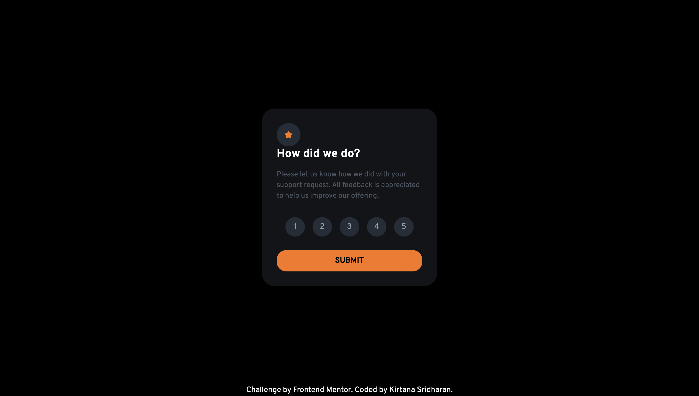
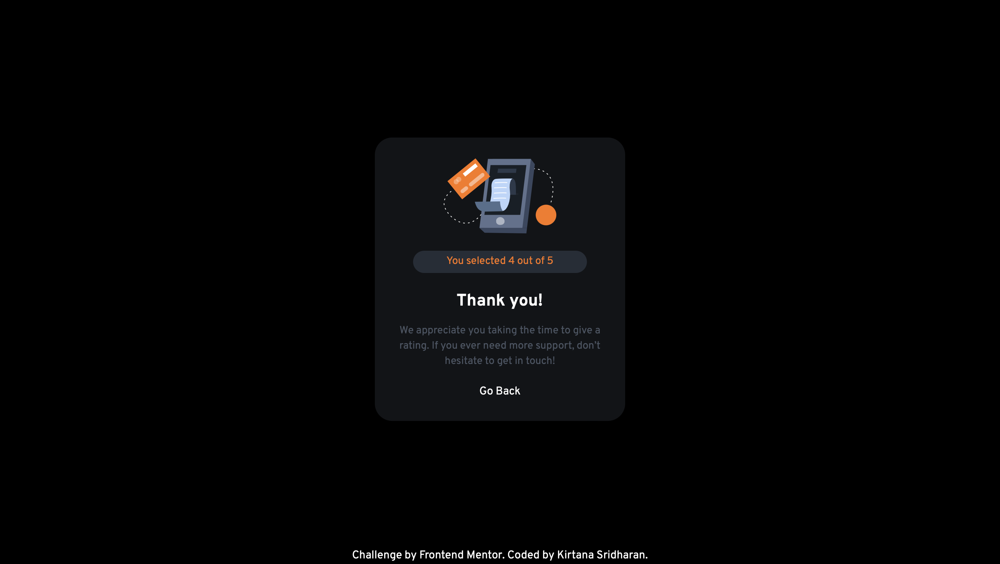

# Frontend Mentor - Interactive rating component solution

This is a solution to the [Interactive rating component challenge on Frontend Mentor](https://www.frontendmentor.io/challenges/interactive-rating-component-koxpeBUmI). Frontend Mentor challenges help you improve your coding skills by building realistic projects. 

## Table of contents

- [Overview](#overview)
  - [The challenge](#the-challenge)
  - [Screenshot](#screenshot)
  - [Links](#links)
  - [Built with](#built-with)
  - [What I learned](#what-i-learned)
- [Author](#author)


## Overview

### The challenge

Users should be able to:

- View the optimal layout for the app depending on their device's screen size
- See hover states for all interactive elements on the page
- Select and submit a number rating
- See the "Thank you" card state after submitting a rating

### Screenshot





### Links

- [Live Site URL](https://frontend-mentor-challenges-zddc.vercel.app)


### Built with

- Semantic HTML5 markup
- CSS custom properties
- Flexbox
- CSS Grid
- [Tailwind CSS] (http://tailwindcss.com)


### What I learned


1. **Event Handling in JavaScript**:
   - Added and managed event listeners:
     ```javascript
     ratingButtons.forEach(button => {
         button.addEventListener('click', () => {
             ratingButtons.forEach(btn => btn.classList.remove('rating-selected'));
             button.classList.add('rating-selected');
         });
     });
     ```

2. **DOM Manipulation**:
   - Toggled visibility between rating and thank-you states:
     ```javascript
     submitButton.addEventListener('click', () => {
         if (selectedRatingValue) {
             document.getElementById('rating-state').classList.add('hidden');
             document.getElementById('thank-you-state').classList.remove('hidden');
             selectedRating.textContent = selectedRatingValue;
         } else {
             alert('Please select a rating before submitting.');
         }
     });
     ```

3. **Responsive Design**:
   - Used media queries for responsiveness:
     ```css
     @media (max-width: 768px) {
         .rating-card {
             width: 90%;
             padding: 20px;
         }
     }

     @media (max-width: 480px) {
         .rating-card {
             width: 95%;
             padding: 15px;
         }
     }
     ```

4. **CSS Transitions and Hover Effects**:
   - Added smooth transitions and hover effects:
     ```css
     .rating-button:hover {
         background-color: white;
         color: hsl(213, 19%, 18%);
     }

     .rating-selected {
         background-color: hsl(25, 97%, 53%);
         color: hsl(213, 19%, 18%);
     }
     ```

5. **Flexbox Layouts**:
   - Utilized Flexbox for centering content:
     ```css
     body {
         display: flex;
         flex-direction: column;
         align-items: center;
         justify-content: center;
         min-height: 100vh;
         background-color: hsl(216, 12%, 8%);
     }
     ```

### Continued Development

1. **Advanced JavaScript Concepts**:
   - Focus on closures, promises, and async/await.

2. **Performance Optimization**:
   - Learn techniques to reduce load times and optimize execution.

3. **CSS Grid Layout**:
   - Explore CSS Grid for complex layouts.

4. **Accessibility**:
   - Improve accessibility with best practices and tools.

5. **Advanced Responsive Design**:
   - Enhance skills in fluid grids, flexible images, and responsive typography.

6. **JavaScript Frameworks**:
   - Explore React, Vue.js, or Angular for dynamic applications.


## Author

- Website - [Kirtana Sridharan](http://kirtanasridharan.github.io/KS_portfolio/)
- Frontend Mentor - [@KirtanaSridharan](https://www.frontendmentor.io/profile/KirtanaSridharan)
- LinkedIn - [Kirtana Sridharan](http://linkedin.com/in/kirtana-sridharan/)


